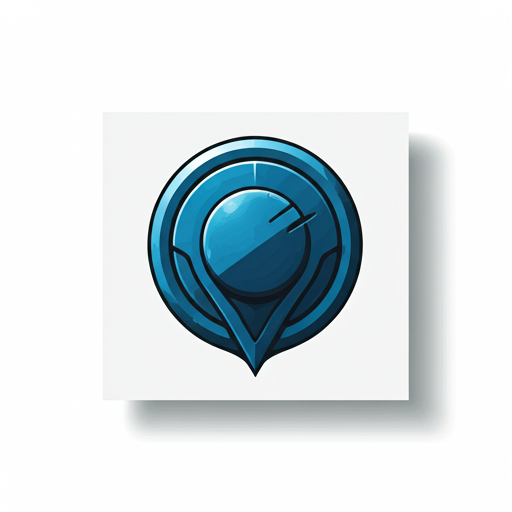

# Crypto Portfolio Tracker

<p align="center">
  
</p>

> 🤖 This project is 100% generated by AI. It's a minimal template designed to be easily extended using AI assistance.

A simple web app to track crypto assets across different exchanges and wallets.

## Quick Start

1. Install dependencies:
```bash
# Server
cd server
npm install

# Client
cd ../client
npm install
```

2. Configure API keys:
```bash
cd server
cp .env.example .env
```

Edit `.env` with your API keys:
- Exchange APIs (Binance, OKX, Kraken, etc.)
- DeBank API for wallet tracking
- CoinMarketCap API for price data

3. Run the app:
```bash
# Terminal 1: Server
cd server
npm run dev

# Terminal 2: Client
cd client
npm run dev
```

Visit `http://localhost:5173`

## Data Storage

Snapshots are saved as CSV files in the `snapshots` directory at the project root. Each file contains:
- Symbol
- Price
- Exchange
- Type
- Amount

## Extend with AI

This is a minimal template. Use AI tools (like Cursor) to:
- Add more exchanges
- Customize the UI
- Add new features
- Modify data processing

## Tech Stack

- Frontend: React + TypeScript + Vite
- Backend: Node.js + Express + TypeScript
- Data: File-based storage (CSV)

## License

MIT 